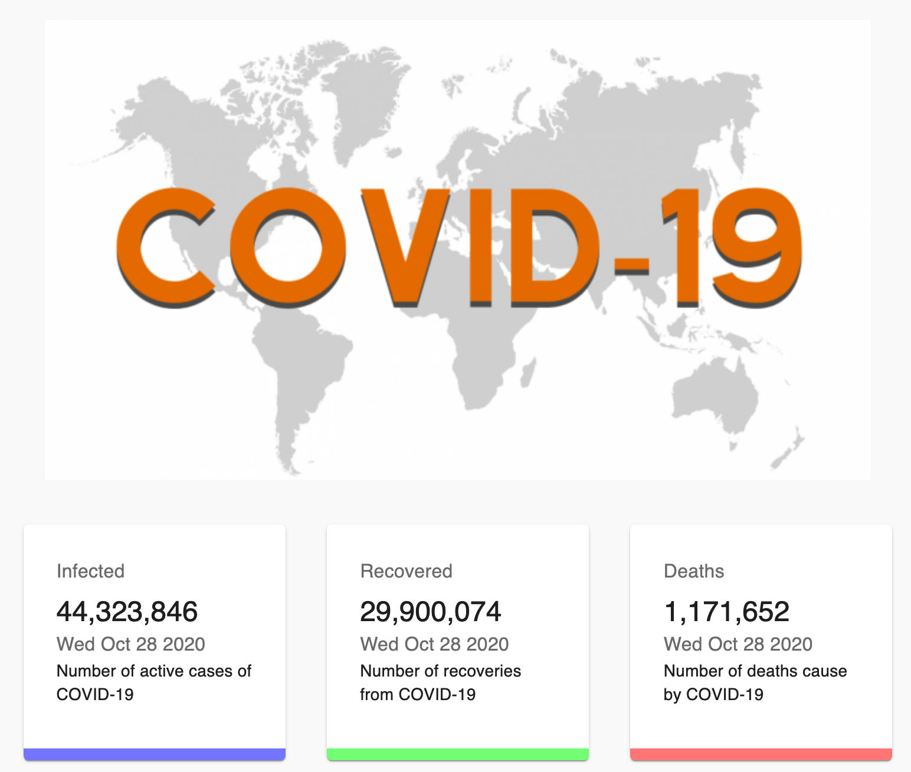

# COVID-19 Tracker

## From this [video](https://www.youtube.com/watch?v=khJlrj3Y6Ls) tutorial.

Create a COVID-19 Tracker, with 
* API: https://covid19.mathdro.id/api
* React
* Charts.JS
* Material UI.
